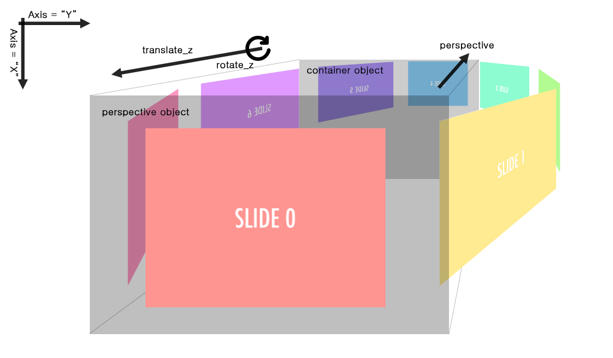

# Slider 3D

###### Figure

### Variable

| Name                | Type          | Description                                       |
|---------------------|---------------|---------------------------------------------------|
| axis                | string        | 슬라이더 배치의 기준이 되는 축                    |
| btn_next            | element       | 슬라이더 네비게이션 버튼                          |
| btn_prev            | element       | 슬라이더 네비게이션 버튼                          |
| container_object    | element       | slider_container 요소                             |
| deg                 | number        | 슬라이더 간의 각도                                |
| dist                | number        | slider_container로부터의 거리에 곱하는 값         |
| element             | element       | slider로 생성한 요소                              |
| perspective_basic   | number        | perspective값을 결정하기위한 기본값               |
| perspective_div     | number        | slide갯수에 따른 perspective값을 조정하기 위한 값 |
| perspective_object  | element       | slider_object 요소                                |
| reverse_dist        | number        | dist값에 대한 보수값                              |
| reverse_rotate_z    | number        | rotate_z값에 대한 역수값                          |
| rotate_z            | number        | slider z축의 회전값                               |
| select_slide_item   | number        | 현재 선택된 slide의 인덱스                        |
| slider_items        | element array | slide들의 집합                                    |
| slider_items_length | number        | slide갯수                                         |
| translate_z         | number        | perspective에 대한 slide들의 거리값               |

### Function

| Name                 | Parameter | Param Type | Description                                            |
|----------------------|-----------|------------|--------------------------------------------------------|
| initAxis             | axis      | string     | axis값을 검사 및 초기화                                |
| initAxisToRotateZ    | deg       | number     | rotate_z값 검사 및 초기화와 reverse_rotate_z 값을 설정 |
| initButton           |           |            | 내부 네비게이션 버튼 생성                              |
| initDistance         | dist      | number     | dist값 검사 및 초기화와 reverse_dist 값을 설정         |
| initSlider           | element   | element    | slider 생성                                            |
| setAutoPlay          | ms        | number     | slider 자동 회전 설정                                  |
| setAxis              | axis      | string     | axis값에 따른 slider방향 설정                          |
| setAxisToRotateZ     | deg       | number     | deg값에 따라 slider의 z축을 기준으로 회전              |
| setDistance          | dis       | number     | container로부터의 거리 설정                            |
| setPerspectiveOrigin | value     | string     | 원근 투영 중심 설정                                    |